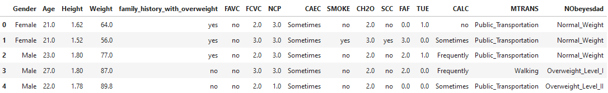
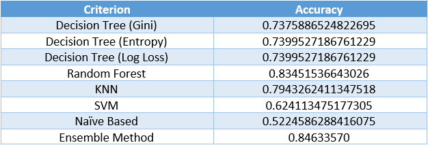

# Data Analysis Project: Estimation of Obesity Levels

Welcome to the **Data Analysis Project** repository for my **Data Mining Course**. This project involves analyzing a dataset focused on obesity levels in individuals based on their eating habits and physical conditions and activities, using various machine learning algorithms.

## Dataset

The dataset used in this project is from the research paper **"Dataset for Estimation of Obesity Levels Based on Eating Habits and Physical Condition in Individuals from Colombia, Peru, and Mexico"**. The dataset provides rich information to explore relationships between lifestyle factors and obesity levels.

### Features of the Dataset:
- Attributes related to eating habits (e.g., frequency of eating high-calorie food).
- Physical condition metrics (e.g., body mass index, physical activity level).
- Demographic data (e.g., age, gender).
- The target variable: **Obesity Level**.

## Example of Dataset
Below is an example of the dataset structure:



## Project Objective

The main goal of this project is to evaluate the effectiveness of various machine learning algorithms in predicting obesity levels. We aim to compare the performance of these algorithms and identify the most suitable approach for this dataset.

## Algorithms Explored

The following algorithms were applied to the dataset:

1. **Decision Tree** (using GINI, Entropy and Log Loss metrics)
2. **Random Forest**
3. **K-Nearest Neighbors (KNN)**
4. **Support Vector Machine (SVM)**
5. **Naive Bayes**
6. **Ensemble Method**

Each algorithm was evaluated based on standard metrics like accuracy, precision, recall and F1-score.

## Repository Structure

```plaintext
├── data/                   # Contains the dataset and any processed files
├── notebooks/              # Jupyter notebooks for data preprocessing, analysis and modeling
├── visuals/                # visualizations and pictures
├── README.md               # Project documentation
```

## Results
- **Random Forest** emerged as the most accurate single algorithm, achieving the highest accuracy among the individual methods tested.
- **Ensemble Method**, which in this case, combining Random Forest, KNN, and SVM with respective weights of 4, 1, and 1, achieved the highest overall accuracy in predicting obesity levels.
- 


## Acknowledgments
- The authors of the dataset for making this resource available.
- My professor, Dr. Fatemeh Bagheri, and my peers, specially Mr. Alireza Lashkarbolooki, for their guidance and support.
